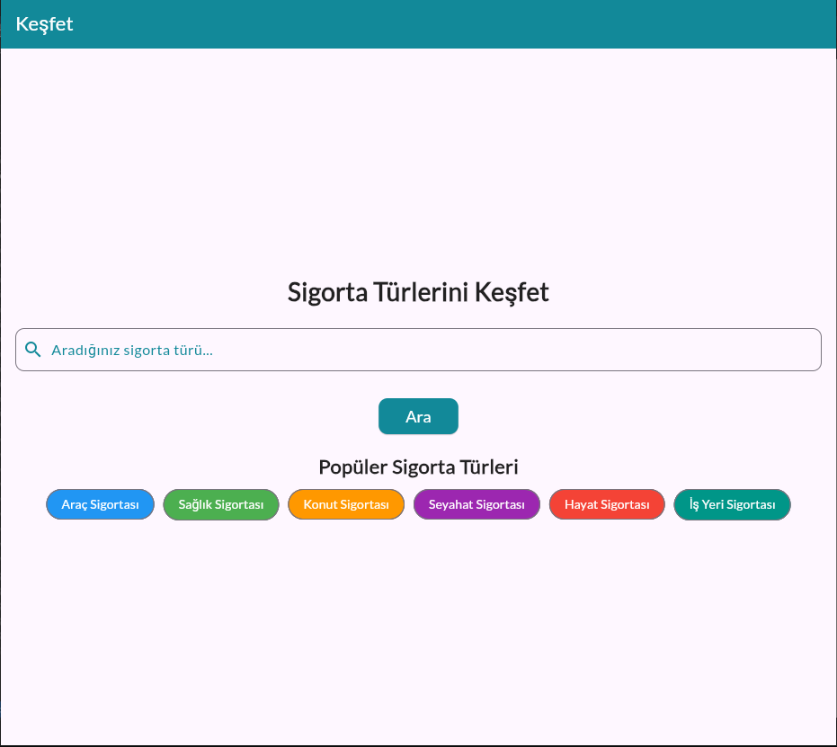
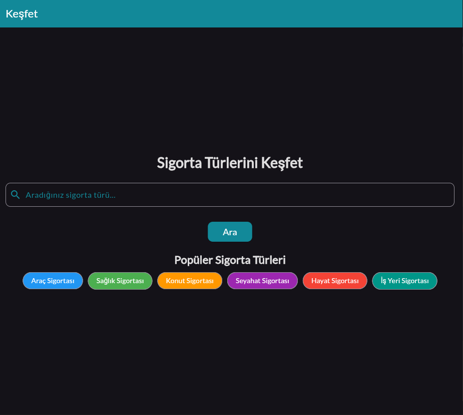
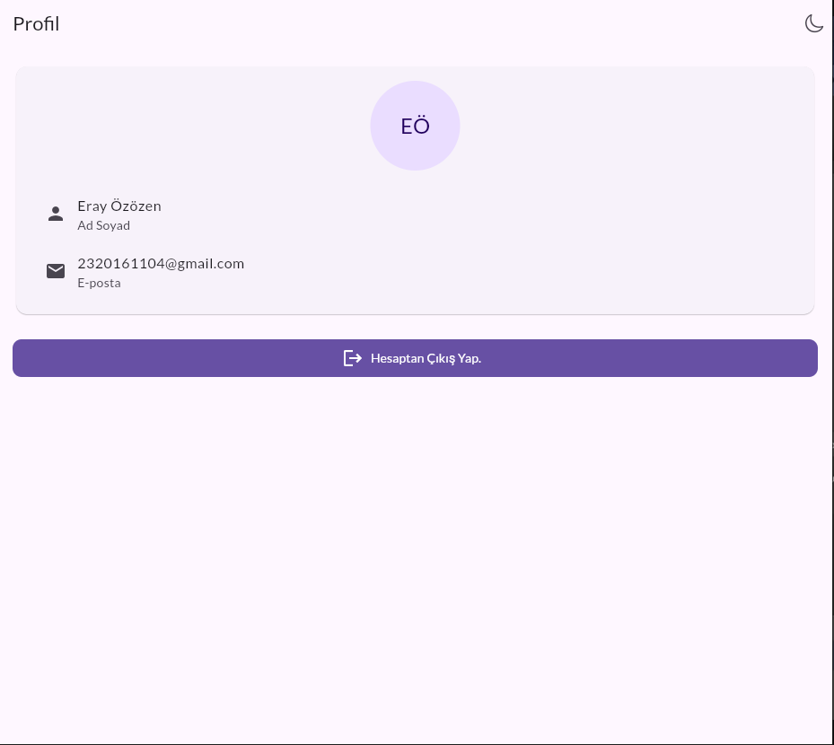
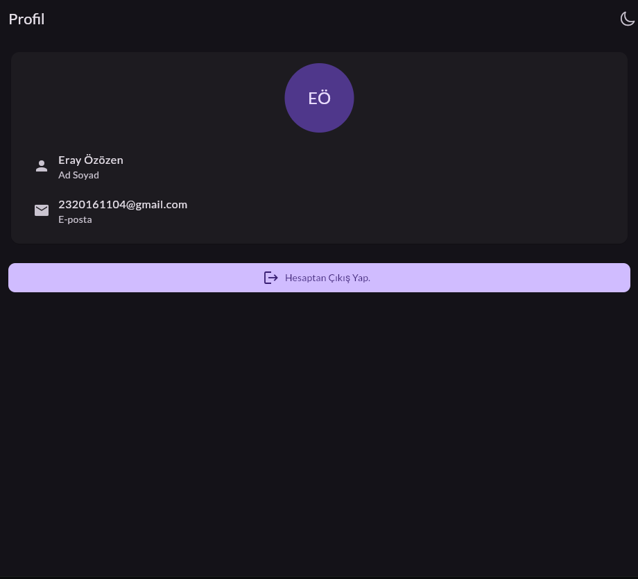
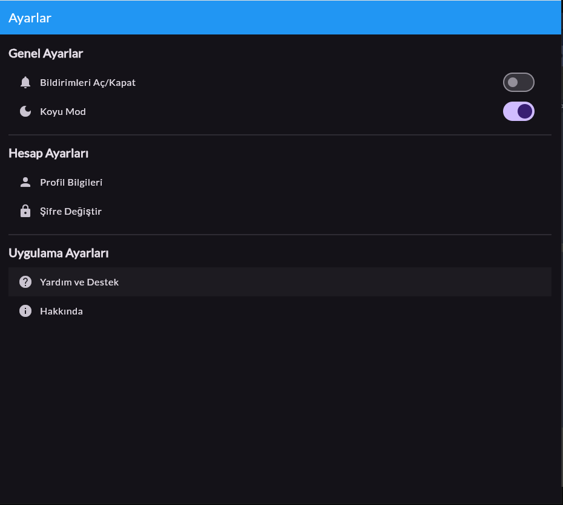

# Flutter Projesi

  


  

## Proje Hakkında

[SigorTAM uygulaması sigorta şirketlerinin kullanıcıların bilgilerini uygulama üzerinden görerek kişiye özel en iyi sigorta teklifini yapmasını sağlar. Bu şekilde hem insanlar kendilerine ve bütçelerine en uygun sigortayı bulurlar hem de boşa vakit kaybetmekten kurtulurlar.]

  

## Ekibimiz

-  **Danışman:**  
[https://github.com/keyvanarasteh](Keyvan Arasteh)


-  **Takım Üyeleri:**

-  [ErayOzozen](https://github.com/ErayOzozen)

  

## Özellikler

- [Kolay ve anlaşılabilir arayüz]

- [Vakitten tasarruf]

- [Bilgi kirliliğini önleme ve Bilinçli para yönetimi]

  

## Kullanılan Teknolojiler

- Flutter

- Dart

- [Diğer teknolojiler]

  

## Başlangıç

  

### Gereksinimler

- Flutter SDK (sürüm X.X.X)

- Dart SDK (sürüm X.X.X)

- [Diğer gerekli yazılımlar]

  

### Kurulum Adımları

1. Projeyi bilgisayarınıza indirin:

```bash

git  clone [https://github.com/ErayOzozen/Q-Flutter]

```

  

2. Proje klasörüne gidin:

```bash

cd [Q-Flutter]
```

  

3. Gerekli paketleri yükleyin:

```bash

flutter  pub  get

```

  

4. Uygulamayı başlatın:

```bash

flutter  run

```

  

## Proje Yapısı

```

lib/

├── modeller/ # Veri modelleri

├── ekranlar/ # Uygulama ekranları

├── widgets/ # Tekrar kullanılabilir arayüz öğeleri

├── servisler/ # API servisleri

└── yardımcılar/ # Yardımcı fonksiyonlar

```

  

## Ekran Görüntüleri

[]







  

## Projeye Katkı Sağlama

1. Projeyi forklayın

2. Yeni bir dal oluşturun (`git checkout -b ozellik/YeniOzellik`)

3. Değişikliklerinizi kaydedin (`git commit -m 'Yeni özellik eklendi'`)

4. Dalınıza gönderin (`git push origin ozellik/YeniOzellik`)

5. Pull Request oluşturun

  

## Lisans

[Lisans türü] kapsamında lisanslanmıştır. Daha fazla bilgi için `LICENSE` dosyasını inceleyebilirsiniz.

  

## İletişim

- Proje Bağlantısı: [[GitHub repository linki](https://github.com/ErayOzozen/Q-Flutter)]

- İstinye Üniversitesi: [https://www.istinye.edu.tr/](https://www.istinye.edu.tr/)

  

## Teşekkürler

- İstinye Üniversitesi'ne destekleri için teşekkür ederiz

- [Diğer teşekkürler]

